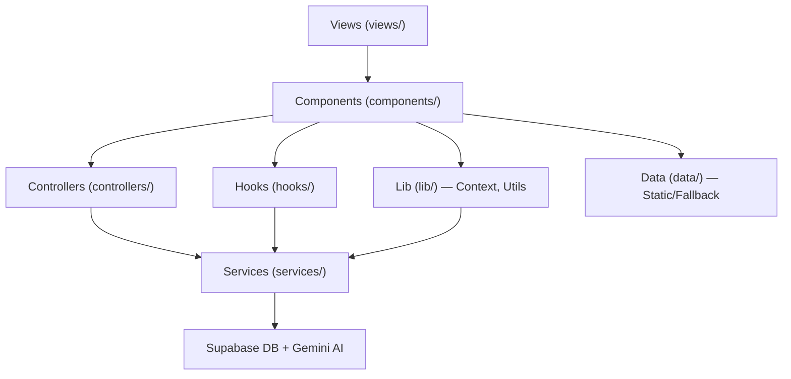

# 🔬 Bedah Mendalam Source Code — Logi Math

## 1. Analisis Konteks & Arsitektur

**Logi Math** adalah aplikasi web edukasi matematika berbasis **React + TypeScript + Vite** dengan backend **Supabase** (PostgreSQL + Auth) dan AI **Google Gemini**. Arsitektur multi-tenant: satu guru memiliki banyak siswa, siswa memilih guru untuk konteks belajar.

### Arsitektur Layer (MVC-ish)



**Alur Kerja Utama:**
1. User login → Supabase Auth → `onAuthStateChange` → fetch `users_data`
2. Siswa memilih guru (`TeacherSelection`) → set `activeTeacherId` di Context
3. Navigasi via `activeTab` state string → `renderContent()` switch-case
4. Soal diambil dari DB guru (`questionService`) atau fallback manual/AI (`gemini.ts`)
5. Progress disimpan ke `student_teacher_progress` dan `users_data`

---

## 2. Ringkasan Temuan

| # | Kategori | File | Masalah | Severity |
|---|----------|------|---------|----------|
| 1 | 🔴 **KEAMANAN KRITIS** | `services/supabase.ts`, `services/gemini.ts` | API keys di-hardcode, bukan dari env var | **CRITICAL** |
| 2 | 🔴 **KEAMANAN KRITIS** | `db.sql` L209-217 | RLS policy "Allow All Authenticated" = zero security | **CRITICAL** |
| 3 | 🔴 **KEAMANAN KRITIS** | `db.sql` L38, `Profile.tsx` L90 | Kolom `password_plain` — menyimpan password plaintext | **CRITICAL** |
| 4 | 🔴 **KEAMANAN** | `.env` | File `.env` berisi real API keys, berpotensi ter-commit | **HIGH** |
| 5 | 🟠 **BUG FUNGSIONAL** | `PosttestFlow.tsx` L65 | Race condition: `score` state belum updated saat `finishPosttest` | **HIGH** |
| 6 | 🟠 **BUG FUNGSIONAL** | `usePractice.ts` L83-88 | `finishSession` menggunakan stale `score` dan `correctCount` | **HIGH** |
| 7 | 🟠 **BUG FUNGSIONAL** | `LearnWrapper` L110 | Update `completed_lessons` ke `users_data` — kolom tidak ada di tabel | **HIGH** |
| 8 | 🟡 **ANTI-PATTERN** | `App.tsx` | Routing via string state, bukan React Router | **MEDIUM** |
| 9 | 🟡 **ANTI-PATTERN** | `services/gemini.ts` L29-34 | 6 instance `GoogleGenAI` identik dibuat — tidak perlu | **MEDIUM** |
| 10 | 🟡 **ANTI-PATTERN** | `index.html` L18 + `package.json` L36 | Tailwind dimuat 2x: CDN di HTML + npm package | **MEDIUM** |
| 11 | 🟡 **BOTTLENECK** | `Forum.tsx` L109-116 | Polling 10 detik tanpa Realtime — N+1 query setiap poll | **MEDIUM** |
| 12 | 🟡 **BOTTLENECK** | `TeacherDashboard.tsx` L29-96 | Query `student_teacher_progress` dipanggil 2x identik | **MEDIUM** |
| 13 | 🟡 **STATE MGMT** | `App.tsx` L90 | `useState<any>` untuk `studentProgress` — kehilangan type safety | **MEDIUM** |
| 14 | 🟡 **STATE MGMT** | `AppContext.tsx` | Context monolitik tanpa splitting — setiap update re-render semua consumer | **MEDIUM** |
| 15 | 🟡 **ANTI-PATTERN** | `lib/supabase.ts`, `lib/gemini.ts`, `types.ts` | Barrel re-export files yang deprecated tapi masih digunakan | **LOW** |
| 16 | 🟢 **KODE KUALITAS** | `App.tsx` L88 | `useEffect` dependency array kosong tapi menggunakan setter — ESLint warning | **LOW** |
| 17 | 🟢 **KODE KUALITAS** | `hooks/*.ts` L28 | `useRef<any>` untuk interval ID | **LOW** |
| 18 | 🟢 **UI/UX** | `PretestFlow.tsx` L167 | Cek disable via `feedbackState.includes('rect')` — hack fragile | **LOW** |

---

## 3. Penjelasan Mendetail Per Masalah

### 🔴 #1 — API Keys Hardcoded (CRITICAL)

**File:** [services/supabase.ts](file:///c:/Files/Thalabul%20Ilmi/S1%20Pmat%20UM/Semester%208,%20Only%20Skripsi/Codingan%20Website/logi%202026.04.24/services/supabase.ts#L10-L11), [services/gemini.ts](file:///c:/Files/Thalabul%20Ilmi/S1%20Pmat%20UM/Semester%208,%20Only%20Skripsi/Codingan%20Website/logi%202026.04.24/services/gemini.ts#L23)

```typescript
// supabase.ts — KEY LANGSUNG DI KODE!
const supabaseUrl = "https://njalgriokwjgegvqsnfb.supabase.co"; 
const supabaseAnonKey = "eyJhbGci...";

// gemini.ts — SAMA
const apiKey = "AIzaSyCkBdx...";
```

**Masalah:** `.env` file sudah dibuat dengan `VITE_SUPABASE_URL` dll, tapi **tidak digunakan**. Kode menggunakan string literal. Jika repo ini di-push ke GitHub, semua API key terekspos.

**Solusi:**
```typescript
// supabase.ts — GUNAKAN ENV VAR
const supabaseUrl = import.meta.env.VITE_SUPABASE_URL;
const supabaseAnonKey = import.meta.env.VITE_SUPABASE_ANON_KEY;

// gemini.ts
const apiKey = import.meta.env.VITE_GEMINI_API_KEY;
```

**Alasan:** Vite sudah menyediakan `import.meta.env` untuk mengakses variabel dari `.env`. Ini adalah standar industri agar key bisa di-rotate tanpa ubah kode, dan `.env` bisa di-gitignore.

---

### 🔴 #2 — RLS Policy "Allow All" (CRITICAL)

**File:** [db.sql](file:///c:/Files/Thalabul%20Ilmi/S1%20Pmat%20UM/Semester%208,%20Only%20Skripsi/Codingan%20Website/logi%202026.04.24/db.sql#L208-L217)

```sql
-- Allow everything for logged in users
CREATE POLICY "Allow All Authenticated" ON public.users_data 
  FOR ALL USING (auth.role() = 'authenticated');
-- (sama untuk SEMUA 9 tabel)
```

**Masalah:** Siapapun yang login bisa:
- **Menghapus/edit data user lain** (termasuk mengubah role jadi "guru")
- **Menghapus semua soal** milik guru lain
- **Membaca password_plain** semua user
- **Memanipulasi skor** siswa manapun

**Solusi:** Buat policy granular per tabel. Contoh:
```sql
-- users_data: user hanya bisa baca sendiri + guru bisa baca muridnya
CREATE POLICY "Users read own" ON public.users_data 
  FOR SELECT USING (id = auth.uid() OR public.is_guru());

CREATE POLICY "Users update own" ON public.users_data 
  FOR UPDATE USING (id = auth.uid());

-- questions: guru hanya bisa CRUD soal miliknya
CREATE POLICY "Teacher manages own questions" ON public.questions
  FOR ALL USING (teacher_id = auth.uid());

-- siswa hanya bisa baca soal guru mereka
CREATE POLICY "Student reads teacher questions" ON public.questions
  FOR SELECT USING (
    teacher_id IN (
      SELECT teacher_id FROM student_teacher_progress WHERE student_id = auth.uid()
    )
  );
```

---

### 🔴 #3 — Password Plaintext (CRITICAL)

**File:** [db.sql](file:///c:/Files/Thalabul%20Ilmi/S1%20Pmat%20UM/Semester%208,%20Only%20Skripsi/Codingan%20Website/logi%202026.04.24/db.sql#L38), [Profile.tsx](file:///c:/Files/Thalabul%20Ilmi/S1%20Pmat%20UM/Semester%208,%20Only%20Skripsi/Codingan%20Website/logi%202026.04.24/components/shared/Profile.tsx#L90)

```sql
password_plain TEXT,  -- KOLOM INI TIDAK BOLEH ADA
```
```typescript
// Profile.tsx saat ganti password:
await supabase.from('users_data').update({ password_plain: newPassword });
```

**Masalah:** Menyimpan password dalam plaintext melanggar prinsip keamanan dasar. Dikombinasikan dengan RLS "Allow All", **siapapun yang login bisa membaca password semua user**.

**Solusi:**
1. **Hapus kolom `password_plain`** dari database: `ALTER TABLE users_data DROP COLUMN password_plain;`
2. **Hapus baris update** di `Profile.tsx` L90
3. Supabase Auth sudah menghandle hashing password secara internal — tidak perlu simpan ulang

---

### 🟠 #5 — Race Condition di PosttestFlow (BUG)

**File:** [PosttestFlow.tsx](file:///c:/Files/Thalabul%20Ilmi/S1%20Pmat%20UM/Semester%208,%20Only%20Skripsi/Codingan%20Website/logi%202026.04.24/components/siswa/PosttestFlow.tsx#L62-L67)

```typescript
const finishPosttest = async () => {
    setStep('result');
    // BUG: 'score' masih nilai LAMA karena setState belum flush!
    // Jika soal terakhir benar, score belum +1 dari checkAnswer()
    const finalRawScore = score + (feedbackState === 'correct' ? 1 : 0); 
    const computedScore = Math.round((finalRawScore / questions.length) * 100);
    setScore(computedScore); // Overwrite score state jadi persentase
    // ...
};
```

**Masalah:** `checkAnswer()` memanggil `setScore(prev => prev + 1)`, lalu `nextQuestion()` langsung panggil `finishPosttest()`. Tapi `score` state belum ter-update karena React batching. Kode mencoba kompensasi dengan `feedbackState === 'correct' ? 1 : 0`, tapi `feedbackState` juga mungkin stale.

**Solusi:** Gunakan `useRef` untuk tracking skor real-time, atau hitung skor dari `results` array:
```typescript
const scoreRef = useRef(0);

const checkAnswer = () => {
    // ...
    if (isCorrect) {
        scoreRef.current += 1;
        setScore(prev => prev + 1); // untuk UI
    }
};

const finishPosttest = async () => {
    const finalScore = Math.round((scoreRef.current / questions.length) * 100);
    // ...
};
```

---

### 🟠 #6 — Stale Closure di usePractice (BUG)

**File:** [usePractice.ts](file:///c:/Files/Thalabul%20Ilmi/S1%20Pmat%20UM/Semester%208,%20Only%20Skripsi/Codingan%20Website/logi%202026.04.24/controllers/usePractice.ts#L83-L88)

```typescript
const finishSession = async () => {
    let finalScore = score; // ← STALE! Masih nilai sebelum handleCheck terakhir
    if (correctCount === questions.length && questions.length > 0) {
        finalScore += 50; // bonus perfect, tapi correctCount juga stale
    }
    // ...
};
```

**Masalah:** Sama seperti #5. `handleNext()` dipanggil setelah `handleCheck()`, dan `handleCheck` melakukan `setScore()` + `setCorrectCount()`. Saat `finishSession()` dipanggil dari `handleNext()`, kedua state masih bernilai **sebelum** update terakhir.

**Solusi:** Sama — gunakan `useRef` untuk real-time tracking atau hitung dari `results` array:
```typescript
const finishSession = async () => {
    // Hitung dari results yang sudah fix
    const totalCorrect = results.filter(r => r.isCorrect).length + 
                         (selectedOption === questions[currentIdx].correctAnswer ? 1 : 0);
    let finalScore = totalCorrect * 50;
    if (totalCorrect === questions.length) finalScore += 50;
    // ...
};
```

---

### 🟠 #7 — Update Kolom yang Tidak Ada (BUG)

**File:** [GameWrappers.tsx (LearnWrapper)](file:///c:/Files/Thalabul%20Ilmi/S1%20Pmat%20UM/Semester%208,%20Only%20Skripsi/Codingan%20Website/logi%202026.04.24/views/student/GameWrappers.tsx#L110)

```typescript
// LearnWrapper L110:
await supabase.from('users_data').update({ 
    exp: newExp, level: newLevel, 
    completed_lessons: newCompleted  // ← KOLOM INI TIDAK ADA DI users_data!
}).eq('id', session.user.id);
```

**Masalah:** Tabel `users_data` di `db.sql` **tidak memiliki** kolom `completed_lessons`. Kolom ini ada di `student_teacher_progress`. Supabase akan mengembalikan error, tapi tidak di-handle (no `.catch()`), sehingga update exp/level juga **gagal silent**.

**Solusi:** Pisahkan update:
```typescript
// Update exp & level (users_data)
await supabase.from('users_data')
    .update({ exp: newExp, level: newLevel })
    .eq('id', session.user.id);

// Update completed_lessons (student_teacher_progress) — sudah ada di L114-116
```

---

### 🟡 #8 — Routing via String State

**File:** [App.tsx](file:///c:/Files/Thalabul%20Ilmi/S1%20Pmat%20UM/Semester%208,%20Only%20Skripsi/Codingan%20Website/logi%202026.04.24/App.tsx#L57)

```typescript
const [activeTab, setActiveTab] = useState('dashboard');
// ...
switch(activeTab) {
    case 'dashboard': return <StudentDashboard .../>;
    case 'learn': return <LearnWrapper .../>;
    // ... 10+ cases
}
```

**Masalah:**
- **Tidak ada URL routing** — user tidak bisa bookmark/share halaman tertentu
- **Refresh = kembali ke dashboard** — kehilangan semua state navigasi
- **Tidak ada browser back/forward** — UX buruk
- Switch-case monolitik sulit di-maintain

**Solusi:** Gunakan `react-router-dom` atau minimal `window.history.pushState`:
```typescript
// Minimal tanpa library:
useEffect(() => {
    window.history.pushState({}, '', `/${activeTab}`);
}, [activeTab]);

window.addEventListener('popstate', () => {
    setActiveTab(window.location.pathname.slice(1) || 'dashboard');
});
```

---

### 🟡 #9 — Multiple GoogleGenAI Instances

**File:** [services/gemini.ts](file:///c:/Files/Thalabul%20Ilmi/S1%20Pmat%20UM/Semester%208,%20Only%20Skripsi/Codingan%20Website/logi%202026.04.24/services/gemini.ts#L29-L34)

```typescript
export const ai = new GoogleGenAI({ apiKey });
export const practiceAi = new GoogleGenAI({ apiKey });
export const mazeQAi = new GoogleGenAI({ apiKey });
export const mazeMapAi = new GoogleGenAI({ apiKey });
export const adventureQAi = new GoogleGenAI({ apiKey });
export const adventureMapAi = new GoogleGenAI({ apiKey });
```

**Masalah:** 6 instance identik dengan API key yang sama. `GoogleGenAI` adalah stateless client — satu instance sudah cukup. Ini membuang memori dan membingungkan pembaca kode.

**Solusi:**
```typescript
export const ai = new GoogleGenAI({ apiKey });
// Gunakan `ai` di semua fungsi generator
```

---

### 🟡 #10 — Tailwind Dimuat 2 Kali

**File:** [index.html](file:///c:/Files/Thalabul%20Ilmi/S1%20Pmat%20UM/Semester%208,%20Only%20Skripsi/Codingan%20Website/logi%202026.04.24/index.html#L18) + [package.json](file:///c:/Files/Thalabul%20Ilmi/S1%20Pmat%20UM/Semester%208,%20Only%20Skripsi/Codingan%20Website/logi%202026.04.24/package.json#L36)

```html
<!-- index.html — CDN -->
<script src="https://cdn.tailwindcss.com"></script>
```
```json
// package.json — npm
"tailwindcss": "^3.4.1",
"postcss": "^8.4.35",
"autoprefixer": "^10.4.18"
```

**Masalah:** Tailwind CDN (~300KB) dimuat di runtime + Tailwind npm package terpasang tapi config `tailwind.config.js` minimal. CSS di-build 2x, CDN version **overrides** npm version. Custom config di `index.html` `<script>` tidak akan terpakai oleh PostCSS pipeline.

**Solusi:** Pilih salah satu:
- **Produksi:** Hapus CDN script, pindahkan custom theme ke `tailwind.config.js`, pastikan PostCSS pipeline jalan
- **Prototyping cepat:** Hapus npm tailwind + postcss, pakai CDN saja (current approach sebenarnya sudah begini, tapi npm packages jadi dead weight)

---

### 🟡 #11 — Forum Polling Tanpa Realtime

**File:** [Forum.tsx](file:///c:/Files/Thalabul%20Ilmi/S1%20Pmat%20UM/Semester%208,%20Only%20Skripsi/Codingan%20Website/logi%202026.04.24/components/shared/Forum.tsx#L109-L116)

```typescript
useEffect(() => {
    fetchConfig();
    fetchMessages(); // ← Full fetch semua messages + join users
    const interval = setInterval(() => {
        fetchMessages();   // Setiap 10 detik!
        fetchConfig(); 
    }, 10000);
    return () => clearInterval(interval);
}, []);
```

**Masalah:** Setiap 10 detik, kode melakukan:
1. `SELECT * FROM forum_messages` (semua pesan)
2. `SELECT id, username, role, avatar_config FROM users_data WHERE id IN (...)` (N+1 pattern)

Ini sangat boros, apalagi Supabase sudah mendukung **Realtime subscriptions**.

**Solusi:**
```typescript
useEffect(() => {
    fetchMessages(); // Initial load saja

    const channel = supabase
        .channel('forum_changes')
        .on('postgres_changes', { event: '*', schema: 'public', table: 'forum_messages' }, () => {
            fetchMessages(); // Refresh hanya saat ada perubahan
        })
        .subscribe();

    return () => { supabase.removeChannel(channel); };
}, []);
```

---

### 🟡 #14 — Context Monolitik

**File:** [AppContext.tsx](file:///c:/Files/Thalabul%20Ilmi/S1%20Pmat%20UM/Semester%208,%20Only%20Skripsi/Codingan%20Website/logi%202026.04.24/lib/AppContext.tsx)

**Masalah:** Satu Context menyimpan: `session`, `userData`, `isLoading`, `gameMode`, `toast`, `modal`, `activeTeacherId` + 10 setter/function. Setiap kali `showToast()` dipanggil (mengubah `toast` state), **semua** komponen yang consume context (termasuk `Sidebar`, `StudentDashboard`, dll.) akan re-render.

**Solusi:** Split context berdasarkan frekuensi update:
```
AuthContext     → session, userData (jarang berubah)
UIContext       → toast, modal (sering berubah, tapi tidak mempengaruhi data)
NavigationCtx   → activeTeacherId, gameMode
```

Atau gunakan library state management seperti **Zustand** yang lebih granular:
```typescript
const useAuthStore = create((set) => ({
    session: null,
    userData: null,
    setSession: (s) => set({ session: s }),
}));
```

---

### 🟡 #18 — Fragile String Check untuk Disable

**File:** [PretestFlow.tsx](file:///c:/Files/Thalabul%20Ilmi/S1%20Pmat%20UM/Semester%208,%20Only%20Skripsi/Codingan%20Website/logi%202026.04.24/components/siswa/PretestFlow.tsx#L167) + [PosttestFlow.tsx](file:///c:/Files/Thalabul%20Ilmi/S1%20Pmat%20UM/Semester%208,%20Only%20Skripsi/Codingan%20Website/logi%202026.04.24/components/siswa/PosttestFlow.tsx#L143)

```typescript
onClick={() => !feedbackState.includes('rect') && setSelectedOption(opt)}
```

**Masalah:** Mengecek apakah `feedbackState` mengandung substring `'rect'` — kebetulan cocok untuk `'correct'` dan `'incorrect'`. Ini sangat fragile dan membingungkan. Jika nama state berubah, kode ini pecah tanpa error.

**Solusi:**
```typescript
onClick={() => feedbackState === 'none' && setSelectedOption(opt)}
```

---

## 4. Rekomendasi Prioritas Perbaikan

| Prioritas | Aksi | Estimasi |
|-----------|------|----------|
| 🔴 **P0** | Pindahkan API keys ke `import.meta.env` | 15 menit |
| 🔴 **P0** | Hapus kolom `password_plain` + kode terkait | 30 menit |
| 🔴 **P0** | Implementasi RLS policies yang proper | 2-3 jam |
| 🟠 **P1** | Fix race condition skor (PosttestFlow + usePractice) | 1 jam |
| 🟠 **P1** | Fix update kolom yang tidak ada di LearnWrapper | 15 menit |
| 🟡 **P2** | Ganti polling dengan Supabase Realtime | 1 jam |
| 🟡 **P2** | Hapus duplikat Tailwind (pilih CDN atau npm) | 30 menit |
| 🟡 **P2** | Konsolidasi GoogleGenAI instances | 15 menit |
| 🟡 **P3** | Split Context / migrasi ke Zustand | 2-3 jam |
| 🟡 **P3** | Implementasi React Router | 2-3 jam |

> [!IMPORTANT]
> **Masalah #1, #2, dan #3 harus diperbaiki SEBELUM deploy ke production.** Saat ini, siapapun yang login bisa membaca password plaintext semua user dan memanipulasi data apapun di database.
