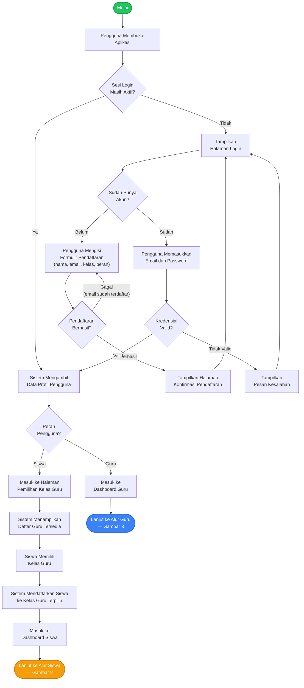
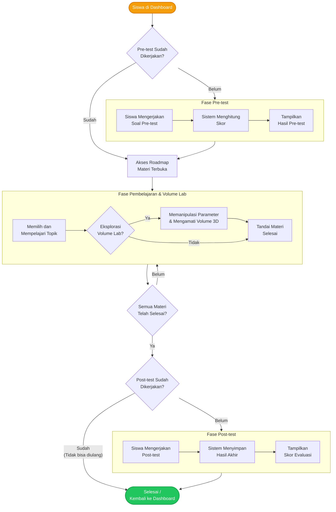
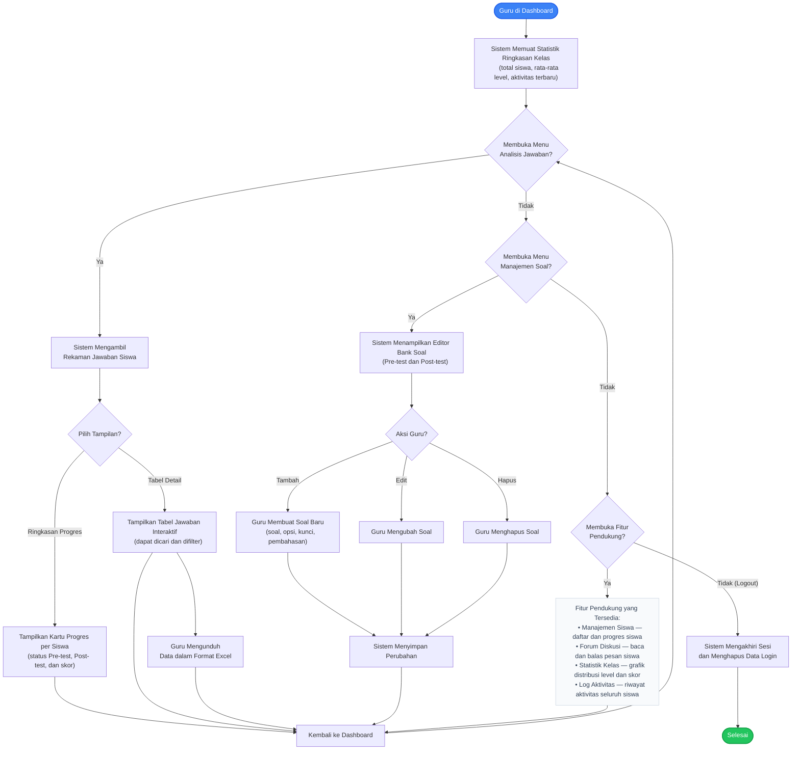

# Activity Diagram — Aplikasi Logi Math (Versi Artikel Skripsi)

> **Catatan:** Diagram ini telah disederhanakan dari detail teknis internal (seperti nama fungsi, tabel database, local storage, dsb.) agar sesuai untuk keperluan publikasi ilmiah. Detail arsitektur teknis direpresentasikan terpisah melalui **Sequence Diagram**.
>
> **Pengecualian:** Fitur Mode Game Petualangan dan Game Labirin tidak dimasukkan.

---

## Gambar 1 — Activity Diagram: Alur Umum Sistem (Autentikasi dan Otorisasi)

Diagram ini menunjukkan alur awal pengguna saat membuka aplikasi hingga diarahkan ke halaman utama berdasarkan perannya (Siswa atau Guru).

**Deskripsi:** Saat pengguna membuka aplikasi, sistem memeriksa apakah sesi login sebelumnya masih aktif. Jika tidak, pengguna diarahkan ke halaman login. Pengguna baru dapat mendaftarkan akun terlebih dahulu. Setelah autentikasi berhasil, sistem mengidentifikasi peran pengguna. Guru diarahkan ke dashboard guru, sedangkan siswa diarahkan ke halaman pemilihan kelas guru sebelum memasuki dashboard siswa.

---

## Gambar 2 — Activity Diagram: Alur Pembelajaran Siswa

Diagram ini menunjukkan perjalanan belajar siswa secara utuh, mulai dari evaluasi awal (Pre-test), eksplorasi materi dan alat peraga interaktif, hingga evaluasi akhir (Post-test). Detail mekanisme pengerjaan soal dapat dilihat pada Gambar 4.

**Deskripsi:** Setelah memasuki dashboard, sistem memeriksa apakah siswa telah menyelesaikan pre-test. Jika belum, akses materi dikunci dan siswa diwajibkan mengerjakan pre-test. Setelah selesai, roadmap materi terbuka. Siswa kemudian memilih topik pelajaran dan dapat menggunakan fitur Volume Lab untuk memanipulasi parameter bangun ruang secara interaktif. Setiap selesai mempelajari topik, progres akan disimpan. Apabila seluruh materi dalam roadmap telah diselesaikan, akses untuk mengerjakan post-test akan terbuka. Post-test dirancang sebagai evaluasi akhir dan hanya dapat dikerjakan satu kali.

---

## Gambar 3 — Activity Diagram: Alur Monitoring oleh Guru

Diagram ini menunjukkan aktivitas guru dalam memantau, menganalisis, dan mengelola proses pembelajaran siswa.

**Deskripsi:** Setelah guru masuk ke dashboard, sistem secara otomatis memuat statistik ringkasan kelas. Alur navigasi guru dirancang bertingkat berdasarkan prioritas fitur. Guru dapat mengakses menu Analisis Jawaban untuk melihat ringkasan progres siswa per individu atau menelusuri data jawaban dalam tabel interaktif yang dapat dicari dan diunduh dalam format Excel. Guru juga dapat mengelola bank soal pre-test dan post-test melalui menu Manajemen Soal, termasuk menambah, mengubah, dan menghapus soal beserta pembahasannya. Fitur pendukung lainnya — meliputi manajemen siswa, forum diskusi, statistik kelas, dan log aktivitas — dapat diakses melalui menu masing-masing. Sesi guru dapat diakhiri kapan saja melalui tombol logout.
