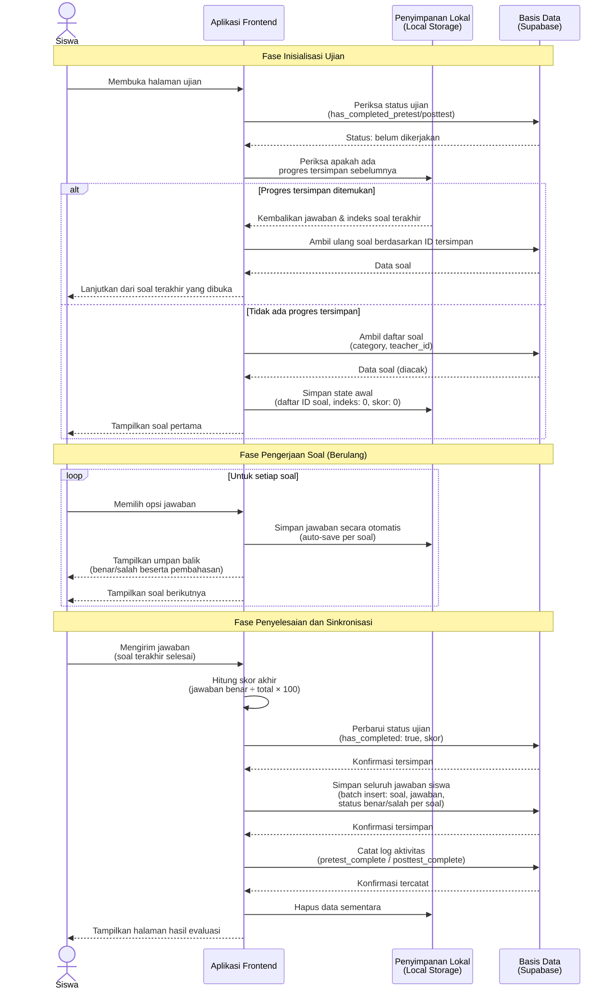
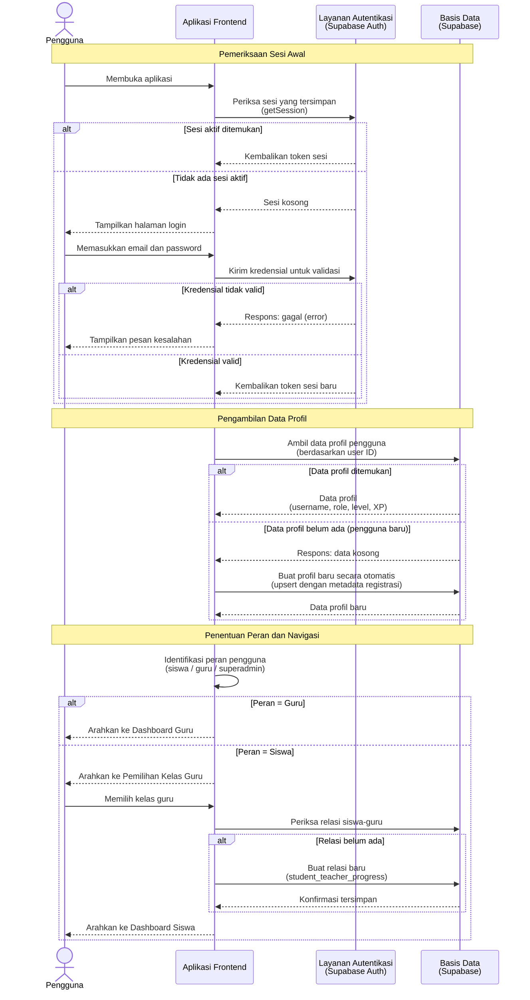
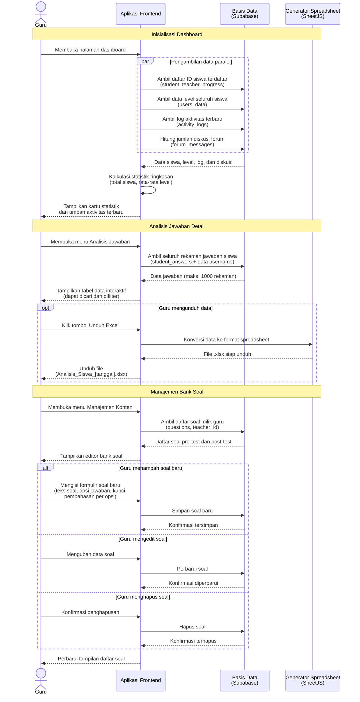

# Sequence Diagram — Arsitektur Data Aplikasi Logi Math (Versi Artikel Skripsi)

> **Catatan:** Diagram ini menunjukkan proses pertukaran data antar komponen sistem secara teknis. Diagram ini melengkapi Activity Diagram yang berfokus pada alur interaksi pengguna. Kedua jenis diagram ini dirancang untuk digunakan bersama di dalam artikel.
>
> **Pengecualian:** Fitur Mode Game Petualangan dan Game Labirin tidak dimasukkan.

---

## Gambar 4 — Sequence Diagram: Mekanisme Pengerjaan Ujian (Pre-test dan Post-test)

Diagram ini menggambarkan arsitektur pertukaran data saat siswa mengerjakan ujian (pre-test maupun post-test), termasuk mekanisme penyimpanan sementara (*local caching*) untuk mencegah kehilangan data.



**Deskripsi:** Ketika siswa membuka halaman ujian, sistem terlebih dahulu memeriksa apakah ujian telah dikerjakan sebelumnya melalui basis data. Apabila belum, sistem memeriksa penyimpanan lokal perangkat (*local storage*) untuk mendeteksi adanya progres yang tersimpan dari sesi sebelumnya (misalnya akibat penutupan browser atau gangguan koneksi). Jika progres ditemukan, pengerjaan dilanjutkan dari soal terakhir yang dikerjakan.

Selama pengerjaan berlangsung, setiap jawaban yang dipilih siswa secara otomatis disimpan ke penyimpanan lokal (*auto-save*). Mekanisme ini menjamin bahwa jawaban siswa tidak hilang meskipun terjadi gangguan teknis.

Setelah seluruh soal dijawab, sistem menghitung skor akhir di sisi klien, kemudian menyinkronisasi data ke basis data dalam tiga operasi: (1) memperbarui status penyelesaian dan skor, (2) menyimpan detail jawaban per soal secara sekaligus (*batch insert*), dan (3) mencatat aktivitas ke log sistem. Setelah sinkronisasi selesai, data sementara di penyimpanan lokal dihapus.

---

## Gambar 5 — Sequence Diagram: Proses Autentikasi dan Inisialisasi Sesi

Diagram ini menunjukkan alur teknis autentikasi pengguna, mulai dari validasi kredensial hingga pengambilan data profil dan penentuan peran.



**Deskripsi:** Saat aplikasi dibuka, sistem memeriksa apakah terdapat sesi autentikasi yang masih aktif melalui layanan autentikasi Supabase. Jika tidak ditemukan, pengguna diminta untuk melakukan login. Setelah autentikasi berhasil, sistem mengambil data profil dari basis data. Untuk pengguna baru yang profilnya belum tercatat (misalnya karena kegagalan *trigger* basis data), sistem secara otomatis membuat profil baru berdasarkan metadata pendaftaran. Selanjutnya, sistem menentukan halaman tujuan berdasarkan peran pengguna.

---

## Gambar 6 — Sequence Diagram: Monitoring dan Analisis Data oleh Guru

Diagram ini menggambarkan proses pengambilan dan penyajian data analisis kepada guru, termasuk mekanisme ekspor data ke format spreadsheet.



**Deskripsi:** Ketika guru membuka dashboard, sistem mengambil beberapa jenis data secara paralel dari basis data untuk menghasilkan ringkasan statistik kelas. Pada menu Analisis Jawaban, seluruh rekaman jawaban siswa ditampilkan dalam tabel interaktif yang mendukung pencarian dan pemfilteran. Guru juga dapat mengekspor data tersebut ke format spreadsheet Excel untuk keperluan analisis lebih lanjut menggunakan aplikasi pihak ketiga (seperti Microsoft Excel atau SPSS). Menu Manajemen Konten memungkinkan guru untuk mengelola bank soal pre-test dan post-test secara mandiri, termasuk menambah, mengubah, dan menghapus soal beserta pembahasan per opsi jawaban.

---

## Panduan Penggunaan Diagram dalam Artikel

### Urutan Penyajian yang Disarankan

| No. | Gambar | Jenis Diagram | Penempatan di Artikel |
|:---:|--------|---------------|----------------------|
| 1 | Gambar 1 | Activity Diagram | Bab Perancangan Sistem — sub-bab alur umum |
| 2 | Gambar 2 | Activity Diagram | Bab Perancangan Sistem — sub-bab alur siswa |
| 3 | Gambar 3 | Activity Diagram | Bab Perancangan Sistem — sub-bab alur guru |
| 4 | Gambar 4 | Sequence Diagram | Bab Perancangan Sistem — sub-bab arsitektur data ujian |
| 5 | Gambar 5 | Sequence Diagram | Bab Perancangan Sistem — sub-bab arsitektur autentikasi |
| 6 | Gambar 6 | Sequence Diagram | Bab Perancangan Sistem — sub-bab arsitektur monitoring |

### Cara Mengekspor ke Gambar (PNG/SVG)
1. Salin kode di dalam blok ` ```mermaid ``` `
2. Buka [Mermaid Live Editor](https://mermaid.live)
3. Tempel kode, lalu klik **Export as PNG** atau **Export as SVG**
4. Sisipkan file gambar ke dokumen artikel Anda
